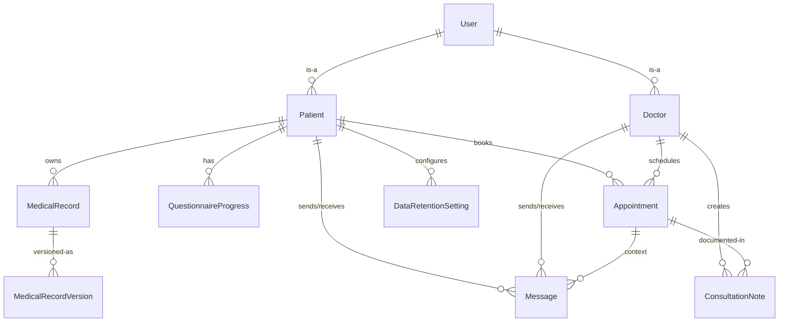

# Data Model Specification

**Feature**: Telemedicine Application  
**Branch**: `001-build-a-telemedicine`  
**Date**: September 10, 2025

## Entity Relationship Overview

## Core Entities

### User (Base Entity)

**Purpose**: Base authentication and profile entity for both patients and doctors

**Fields**:

- `id` (UUID, Primary Key): Unique identifier
- `email` (String, Unique, Not Null): Email address for authentication
- `password_hash` (String, Not Null): Bcrypt hashed password
- `user_type` (Enum: 'patient' | 'doctor'): Role discrimination
- `is_active` (Boolean, Default: True): Account status
- `created_at` (DateTime, Not Null): Account creation timestamp
- `updated_at` (DateTime, Not Null): Last modification timestamp
- `last_login` (DateTime, Nullable): Last login timestamp

**Validation Rules**:

- Email must be valid format and unique across system
- Password must be hashed using bcrypt with minimum 12 rounds
- User type cannot be changed after creation
- Email changes require verification process

**Relationships**:

- One-to-One with Patient (when user_type = 'patient')
- One-to-One with Doctor (when user_type = 'doctor')

### Patient (Extends User)

**Purpose**: Patient-specific profile information and medical data ownership

**Fields**:

- `user_id` (UUID, Foreign Key → User.id, Primary Key): Link to base user
- `username` (String, Unique, Not Null): Patient-chosen display name
- `first_name` (String, Not Null): Given name
- `last_name` (String, Not Null): Family name
- `date_of_birth` (Date, Not Null): Birth date for age calculations
- `phone_number` (String, Nullable): Contact phone
- `emergency_contact_name` (String, Nullable): Emergency contact person
- `emergency_contact_phone` (String, Nullable): Emergency contact number
- `profile_completed` (Boolean, Default: False): Initial questionnaire completion status

**Validation Rules**:

- Username must be unique and 3-50 characters
- Date of birth cannot be in future
- Phone numbers must be valid format when provided
- Profile completion tracked based on required questionnaire sections

**Relationships**:

- One-to-Many with MedicalRecord
- One-to-Many with Appointment
- One-to-Many with Message
- One-to-One with QuestionnaireProgress
- One-to-One with DataRetentionSetting

### Doctor (Extends User)

**Purpose**: Healthcare provider profiles with specializations and availability

**Fields**:

- `user_id` (UUID, Foreign Key → User.id, Primary Key): Link to base user
- `doctor_id` (String, Unique, Not Null): Pre-assigned unique identifier
- `first_name` (String, Not Null): Given name
- `last_name` (String, Not Null): Family name
- `specializations` (JSON Array, Not Null): List of medical specialties
- `license_number` (String, Nullable): Medical license identifier
- `credentials` (JSON Object, Nullable): Education and certifications
- `bio` (Text, Nullable): Professional biography
- `years_experience` (Integer, Nullable): Years of practice
- `consultation_fee` (Decimal, Default: 0.00): Fee per consultation (free for v1)
- `is_accepting_patients` (Boolean, Default: True): Availability status

**Validation Rules**:

- Doctor ID must be pre-populated in database (hardcoded for v1)
- Specializations must contain at least one valid specialty
- Years experience cannot be negative
- Consultation fee set to 0.00 for v1 (free consultations)

**Relationships**:

- One-to-Many with Appointment
- One-to-Many with Message
- One-to-Many with ConsultationNote
- One-to-Many with DoctorAvailability

### MedicalRecord

**Purpose**: Core medical information container with versioning support

**Fields**:

- `id` (UUID, Primary Key): Unique record identifier
- `patient_id` (UUID, Foreign Key → Patient.user_id, Not Null): Owner patient
- `record_type` (Enum: 'medical_history' | 'medication' | 'allergy' | 'procedure'): Data category
- `title` (String, Not Null): Brief description of the record
- `current_version` (Integer, Not Null, Default: 1): Latest version number
- `is_active` (Boolean, Default: True): Record status
- `created_at` (DateTime, Not Null): Initial creation timestamp
- `updated_at` (DateTime, Not Null): Last modification timestamp

**Validation Rules**:

- Patient must exist and be active
- Record type must be valid enum value
- Version number increments automatically on updates
- Soft deletion via is_active flag

**Relationships**:

- Many-to-One with Patient
- One-to-Many with MedicalRecordVersion

### MedicalRecordVersion

**Purpose**: Immutable snapshots of medical record changes with audit trail

**Fields**:

- `id` (UUID, Primary Key): Unique version identifier
- `medical_record_id` (UUID, Foreign Key → MedicalRecord.id, Not Null): Parent record
- `version_number` (Integer, Not Null): Sequential version number
- `data` (JSON, Not Null): Complete record data snapshot
- `change_reason` (String, Nullable): Reason for the update
- `changed_by_user_id` (UUID, Foreign Key → User.id, Not Null): User who made change
- `changed_by_user_type` (Enum: 'patient' | 'doctor'): Role of user who made change
- `created_at` (DateTime, Not Null): Version creation timestamp

**Validation Rules**:

- Version numbers must be sequential and immutable
- Data field contains complete record state at time of version
- Change reason required for doctor-initiated updates
- Created timestamp is immutable

**Relationships**:

- Many-to-One with MedicalRecord
- Many-to-One with User (changed_by)

### QuestionnaireProgress

**Purpose**: Tracks completion status of medical history questionnaire sections

**Fields**:

- `id` (UUID, Primary Key): Unique progress identifier
- `patient_id` (UUID, Foreign Key → Patient.user_id, Unique, Not Null): Owner patient
- `family_history_completed` (Boolean, Default: False): Family medical history section
- `current_conditions_completed` (Boolean, Default: False): Active medical conditions
- `past_procedures_completed` (Boolean, Default: False): Previous surgeries/procedures
- `medications_completed` (Boolean, Default: False): Current medications list
- `allergies_completed` (Boolean, Default: False): Known allergies and reactions
- `drug_resistance_completed` (Boolean, Default: False): Known drug resistances
- `personal_info_completed` (Boolean, Default: False): Basic personal information
- `emergency_contacts_completed` (Boolean, Default: False): Emergency contact details
- `overall_completion_percentage` (Integer, Default: 0): Calculated completion percentage
- `last_updated` (DateTime, Not Null): Last progress update timestamp

**Validation Rules**:

- One questionnaire progress per patient
- Completion percentage calculated based on completed sections
- Cannot mark sections complete without required data
- Progress persists across sessions

**Relationships**:

- One-to-One with Patient

### Appointment

**Purpose**: Scheduled consultations between patients and doctors

**Fields**:

- `id` (UUID, Primary Key): Unique appointment identifier
- `patient_id` (UUID, Foreign Key → Patient.user_id, Not Null): Patient participant
- `doctor_id` (UUID, Foreign Key → Doctor.user_id, Not Null): Doctor participant
- `scheduled_start` (DateTime, Not Null): Appointment start time
- `scheduled_end` (DateTime, Not Null): Appointment end time
- `status` (Enum: 'scheduled' | 'in_progress' | 'completed' | 'cancelled'): Current status
- `appointment_type` (Enum: 'consultation' | 'follow_up' | 'urgent'): Type of appointment
- `reason_for_visit` (Text, Nullable): Patient-provided reason
- `preparation_notes` (Text, Nullable): Pre-appointment instructions
- `cost` (Decimal, Default: 0.00): Appointment cost (free for v1)
- `created_at` (DateTime, Not Null): Booking timestamp
- `updated_at` (DateTime, Not Null): Last status change timestamp

**Validation Rules**:

- Scheduled end must be after scheduled start
- No overlapping appointments for same doctor
- Patient can have maximum 3 future appointments
- Status transitions must follow valid workflow
- Cost set to 0.00 for v1 (free consultations)

**Relationships**:

- Many-to-One with Patient
- Many-to-One with Doctor
- One-to-Many with Message
- One-to-Many with ConsultationNote

### Message

**Purpose**: Secure text-based communication between patients and doctors

**Fields**:

- `id` (UUID, Primary Key): Unique message identifier
- `sender_id` (UUID, Foreign Key → User.id, Not Null): Message sender
- `recipient_id` (UUID, Foreign Key → User.id, Not Null): Message recipient
- `appointment_id` (UUID, Foreign Key → Appointment.id, Nullable): Related appointment
- `content` (Text, Not Null): Message content (text only, no attachments in v1)
- `message_type` (Enum: 'text' | 'system_notification'): Message category
- `is_read` (Boolean, Default: False): Read status
- `sent_at` (DateTime, Not Null): Message timestamp
- `read_at` (DateTime, Nullable): Read timestamp

**Validation Rules**:

- Sender and recipient must be different users
- Content cannot be empty and maximum 2000 characters
- System notifications can only be sent by system user
- Messages are immutable after sending
- Only text messages supported in v1

**Relationships**:

- Many-to-One with User (sender)
- Many-to-One with User (recipient)
- Many-to-One with Appointment (optional context)

### ConsultationNote

**Purpose**: Professional notes added by doctors after patient consultations

**Fields**:

- `id` (UUID, Primary Key): Unique note identifier
- `appointment_id` (UUID, Foreign Key → Appointment.id, Not Null): Related appointment
- `doctor_id` (UUID, Foreign Key → Doctor.user_id, Not Null): Note author
- `patient_id` (UUID, Foreign Key → Patient.user_id, Not Null): Note subject
- `subjective` (Text, Nullable): Patient-reported symptoms and concerns
- `objective` (Text, Nullable): Doctor's observations and findings
- `assessment` (Text, Nullable): Medical assessment and diagnosis
- `plan` (Text, Nullable): Treatment plan and recommendations
- `follow_up_required` (Boolean, Default: False): Follow-up appointment needed
- `follow_up_timeframe` (String, Nullable): Recommended follow-up timing
- `medications_prescribed` (JSON Array, Nullable): List of prescribed medications
- `recommendations` (Text, Nullable): General health recommendations
- `created_at` (DateTime, Not Null): Note creation timestamp
- `updated_at` (DateTime, Not Null): Last modification timestamp

**Validation Rules**:

- Only doctors can create consultation notes
- Doctor must be the same as appointment doctor
- Patient must be the same as appointment patient
- Notes can be updated within 24 hours of creation
- At least one SOAP section must be completed

**Relationships**:

- Many-to-One with Appointment
- Many-to-One with Doctor
- Many-to-One with Patient

### DataRetentionSetting

**Purpose**: User-controlled data retention and privacy preferences

**Fields**:

- `id` (UUID, Primary Key): Unique setting identifier
- `patient_id` (UUID, Foreign Key → Patient.user_id, Unique, Not Null): Owner patient
- `retention_period_weeks` (Integer, Nullable): Weeks to retain data (null = indefinite)
- `auto_delete_enabled` (Boolean, Default: False): Automatic deletion preference
- `deletion_requested` (Boolean, Default: False): Immediate deletion requested
- `deletion_request_date` (DateTime, Nullable): When deletion was requested
- `minimum_retention_weeks` (Integer, Default: 8): System minimum retention
- `data_categories` (JSON Array, Not Null): Which data types to retain/delete
- `created_at` (DateTime, Not Null): Setting creation timestamp
- `updated_at` (DateTime, Not Null): Last modification timestamp

**Validation Rules**:

- Retention period must be at least minimum_retention_weeks
- Data categories must include valid category names
- Deletion request cannot be undone
- Auto-delete requires specific retention period (not indefinite)

**Relationships**:

- One-to-One with Patient

### DoctorAvailability

**Purpose**: Doctor scheduling and availability management

**Fields**:

- `id` (UUID, Primary Key): Unique availability identifier
- `doctor_id` (UUID, Foreign Key → Doctor.user_id, Not Null): Doctor setting availability
- `day_of_week` (Integer, Not Null): Day (0=Monday to 6=Sunday)
- `start_time` (Time, Not Null): Available start time
- `end_time` (Time, Not Null): Available end time
- `time_zone` (String, Not Null): Doctor's time zone
- `appointment_duration_minutes` (Integer, Default: 30): Default appointment length
- `buffer_minutes` (Integer, Default: 15): Buffer between appointments
- `is_active` (Boolean, Default: True): Availability status
- `effective_date` (Date, Not Null): When availability starts
- `expiry_date` (Date, Nullable): When availability ends (null = indefinite)

**Validation Rules**:

- End time must be after start time
- Day of week must be 0-6
- Appointment duration must be positive
- Buffer minutes cannot be negative
- Time zone must be valid IANA timezone

**Relationships**:

- Many-to-One with Doctor

## Data Validation Summary

### Cross-Entity Constraints

1. **Appointment Scheduling**: No double-booking for doctors
2. **Message Recipients**: Must be patient-doctor pairs with active appointment
3. **Medical Record Versions**: Must maintain chronological order
4. **Consultation Notes**: Only after appointment completion
5. **Data Retention**: Respects user preferences while maintaining minimum periods

### Audit Trail Requirements

1. **Medical Record Changes**: All versions preserved with user attribution
2. **Authentication Events**: Login/logout timestamps and IP addresses
3. **Data Access**: Who accessed which patient records when
4. **Appointment Changes**: Status transitions with timestamps
5. **Message Delivery**: Sent/read status tracking

### Performance Considerations

1. **Indexing Strategy**:
   - Composite index on (patient_id, created_at) for medical records
   - Index on (doctor_id, scheduled_start) for appointments
   - Full-text search index on message content
2. **Partitioning**:
   - Consider partitioning medical_record_versions by date
   - Archive old messages beyond retention period
3. **Caching**:
   - Doctor availability cached for 5 minutes
   - Patient questionnaire progress cached during session

## Migration Strategy

### Phase 1: Core Tables

1. Create User, Patient, Doctor tables
2. Set up authentication and basic profiles
3. Insert initial doctor records with pre-assigned IDs

### Phase 2: Medical Data

1. Create MedicalRecord and MedicalRecordVersion tables
2. Set up versioning triggers and procedures
3. Create QuestionnaireProgress tracking

### Phase 3: Appointments & Messaging

1. Create Appointment and DoctorAvailability tables
2. Create Message table with real-time capabilities
3. Create ConsultationNote table

### Phase 4: Data Management

1. Create DataRetentionSetting table
2. Set up automated cleanup jobs
3. Implement audit logging tables

---

## Next Steps

This data model will be implemented using SQLAlchemy models with corresponding Pydantic schemas for API serialization. The next phase will generate:

1. API contracts based on these entities
2. Database migration scripts
3. Test data fixtures for development

**Data Model Status**: ✅ COMPLETE - All entities defined with relationships and validation rules
